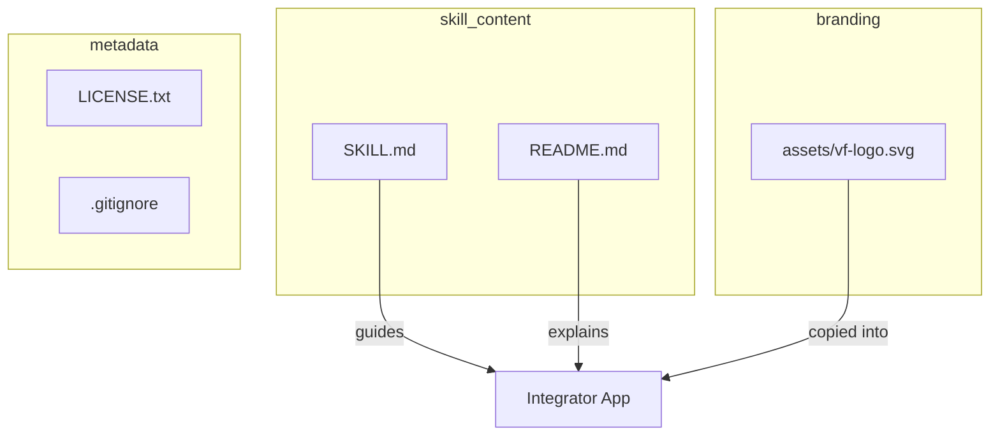
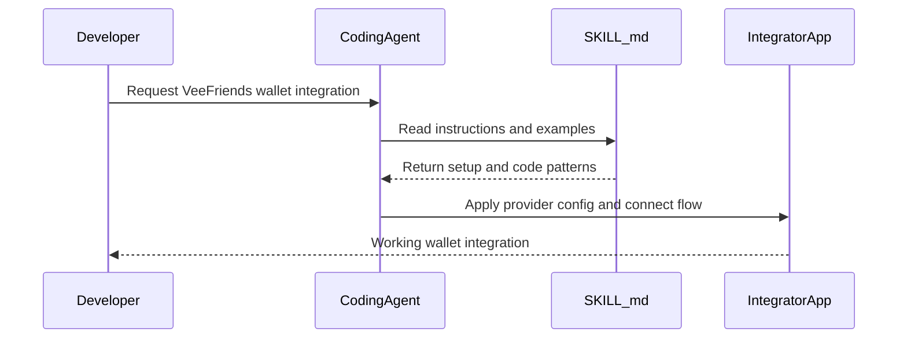

# VeeFriends Global Wallet Skill - Codebase Map

## Overview

This repository is a documentation-first skill package for AI coding agents. The core logic lives in `SKILL.md`, which defines the integration workflow for adding VeeFriends Global Wallet using Privy cross-app accounts in Next.js apps. The repository also includes branding assets and a GitHub-facing README.



## Directory Structure

```text
vf-global-wallet-skill/
|-- SKILL.md                 # Primary skill instructions for agents
|-- README.md                # Human-facing docs for GitHub and onboarding
|-- LICENSE.txt              # MIT license
|-- .gitignore               # Local artifact exclusions
`-- assets/
    `-- vf-logo.svg          # Official required wallet branding asset
```

## Module Guide

### Skill Definition

**Purpose:** Defines the complete implementation workflow and constraints for VeeFriends wallet integration.
**Entry point:** `SKILL.md`

| File | Purpose | Key exports |
|------|---------|-------------|
| `SKILL.md` | Canonical implementation guide and examples | N/A (instruction document) |

### Distribution Docs

**Purpose:** Explains what the skill does and how users install/use it.
**Entry point:** `README.md`

| File | Purpose | Key exports |
|------|---------|-------------|
| `README.md` | User-facing summary and setup guidance | N/A (documentation) |

### Branding Asset

**Purpose:** Provides the required VeeFriends wallet icon for downstream apps.
**Entry point:** `assets/vf-logo.svg`

| File | Purpose | Key exports |
|------|---------|-------------|
| `assets/vf-logo.svg` | Official VeeFriends logo used by integrators | N/A (SVG asset) |

## Data Flow



## Conventions

- **Naming:** Root-level docs use uppercase markdown names (`SKILL.md`, `README.md`) and static assets live under `assets/`.
- **Error handling:** Guidance is documented, not executed; runtime errors are handled in consumer app examples (popup blocked, cancel, missing account).
- **Configuration:** Example env vars are public Next.js client vars (`NEXT_PUBLIC_*`) and include both requester app and provider app IDs.
- **Testing:** No automated tests in this repository; validation is manual review plus reference implementation checks.

## Navigation Guide

> These are the most actionable entries for agents working in this codebase.

- **To update integration behavior:** edit `/Users/jeremy/content-condor/tmp/vf-global-wallet-skill/SKILL.md` and align terminology in `/Users/jeremy/content-condor/tmp/vf-global-wallet-skill/README.md`.
- **To update branding requirements:** edit `/Users/jeremy/content-condor/tmp/vf-global-wallet-skill/SKILL.md` and verify `/Users/jeremy/content-condor/tmp/vf-global-wallet-skill/assets/vf-logo.svg`.
- **To change setup defaults (provider IDs, login methods):** update `/Users/jeremy/content-condor/tmp/vf-global-wallet-skill/SKILL.md` and `/Users/jeremy/content-condor/tmp/vf-global-wallet-skill/README.md`.
- **To debug installation confusion:** start in `/Users/jeremy/content-condor/tmp/vf-global-wallet-skill/README.md`, then confirm usage details in `/Users/jeremy/content-condor/tmp/vf-global-wallet-skill/SKILL.md`.
